# Enhanced EKS Cluster - Architecture Documentation

## Overview

This document provides detailed architectural specifications for creating accurate architectural diagrams of the Enhanced EKS Cluster deployed in AWS GovCloud (us-gov-west-1).

## Architecture Diagram

```mermaid
graph TB
    subgraph Internet
        Users[Users/Clients]
    end

    subgraph "AWS GovCloud us-gov-west-1"
        IGW[Internet Gateway]
        
        subgraph "VPC 10.0.0.0/16"
            subgraph "AZ-1 us-gov-west-1a"
                PubSub1["Public Subnet<br/>10.0.48.0/20"]
                PrivSub1["Private Subnet<br/>10.0.0.0/20"]
                NAT[NAT Gateway]
                NLB["Istio Ingress<br/>NLB"]
                Nodes1["Worker Nodes<br/>(Auto Mode)"]
            end
            
            subgraph "AZ-2 us-gov-west-1b"
                PubSub2["Public Subnet<br/>10.0.64.0/20"]
                PrivSub2["Private Subnet<br/>10.0.16.0/20"]
                Nodes2["Worker Nodes<br/>(Auto Mode)"]
            end
            
            subgraph "AZ-3 us-gov-west-1c"
                PubSub3["Public Subnet<br/>10.0.80.0/20"]
                PrivSub3["Private Subnet<br/>10.0.32.0/20"]
                Nodes3["Worker Nodes<br/>(Auto Mode)"]
            end
            
            subgraph "EKS Control Plane (AWS Managed)"
                API["API Server<br/>(Multi-AZ)"]
                ETCD["etcd<br/>(3 replicas)"]
            end
            
            subgraph "Nodes1"
                subgraph "istio-system namespace"
                    Istiod["Istiod<br/>(Control Plane)"]
                    IstioGW["Istio Gateway<br/>(2 replicas)"]
                    Kiali["Kiali<br/>(Visualization)"]
                end
                
                subgraph "keda namespace"
                    KEDA["KEDA Operator<br/>(Autoscaling)"]
                end
                
                subgraph "prometheus namespace"
                    Prom["Prometheus<br/>(Metrics)"]
                end
                
                subgraph "kube-system namespace"
                    LBC["AWS LB Controller"]
                    MS["Metrics Server"]
                    CoreDNS["CoreDNS"]
                    VPC_CNI["VPC CNI"]
                end
                
                subgraph "default namespace"
                    App1["Application Pods<br/>(with Istio sidecar)"]
                end
            end
        end
        
        subgraph "AWS Services"
            XRay["AWS X-Ray<br/>(Tracing)"]
            CWL["CloudWatch Logs"]
            ECR["ECR<br/>(Container Registry)"]
            EBS["EBS Volumes"]
            EFS["EFS"]
            S3["S3 Buckets"]
            Bedrock["Amazon Bedrock"]
            RDS["RDS Databases"]
            DDB["DynamoDB"]
        end
    end
    
    Users -->|HTTPS| IGW
    IGW --> PubSub1
    PubSub1 --> NLB
    NLB --> IstioGW
    IstioGW -->|mTLS| App1
    
    PrivSub1 --> NAT
    PrivSub2 --> NAT
    PrivSub3 --> NAT
    NAT --> PubSub1
    PubSub1 --> IGW
    
    Nodes1 --> API
    Nodes2 --> API
    Nodes3 --> API
    
    App1 -->|Traces| XRay
    App1 -->|Logs| CWL
    App1 -->|Images| ECR
    App1 -->|Storage| EBS
    App1 -->|Shared Storage| EFS
    App1 -->|Object Storage| S3
    App1 -->|AI/ML| Bedrock
    App1 -->|Database| RDS
    App1 -->|NoSQL| DDB
    
    Prom -->|Scrape Metrics| App1
    Kiali -->|Query| Prom
    Istiod -->|Inject Sidecar| App1
    KEDA -->|Scale| App1
    MS -->|Metrics| API
    
    style Users fill:#e1f5ff
    style IGW fill:#ff9900
    style NAT fill:#ffcc00
    style NLB fill:#00cc00
    style API fill:#0066cc
    style ETCD fill:#0066cc
    style Istiod fill:#466bb0
    style IstioGW fill:#466bb0
    style Kiali fill:#466bb0
    style KEDA fill:#326ce5
    style Prom fill:#e6522c
    style XRay fill:#ff9900
    style App1 fill:#326ce5
```



---

## 1. Network Architecture

### 1.1 VPC Layout

**VPC:**
- CIDR: 10.0.0.0/16
- DNS Hostnames: Enabled
- DNS Support: Enabled
- Region: us-gov-west-1
- Availability Zones: 3 (us-gov-west-1a, us-gov-west-1b, us-gov-west-1c)

### 1.2 Subnets

**Public Subnets (3):**
- Public Subnet 1: 10.0.48.0/20 (AZ-1)
- Public Subnet 2: 10.0.64.0/20 (AZ-2)
- Public Subnet 3: 10.0.80.0/20 (AZ-3)
- Tags: `kubernetes.io/role/elb=1`
- Purpose: Internet-facing load balancers, NAT Gateway

**Private Subnets (3):**
- Private Subnet 1: 10.0.0.0/20 (AZ-1)
- Private Subnet 2: 10.0.16.0/20 (AZ-2)
- Private Subnet 3: 10.0.32.0/20 (AZ-3)
- Tags: `kubernetes.io/role/internal-elb=1`
- Purpose: EKS nodes, internal load balancers

### 1.3 Internet Connectivity

**Internet Gateway:**
- Attached to VPC
- Provides internet access for public subnets

**NAT Gateway:**
- Single NAT Gateway in Public Subnet 1 (AZ-1)
- Elastic IP attached
- Provides outbound internet for all private subnets
- Note: Single NAT for cost optimization (not HA)

### 1.4 Route Tables

**Public Route Table:**
- Routes: 0.0.0.0/0 → Internet Gateway
- Associated with: All 3 public subnets

**Private Route Table:**
- Routes: 0.0.0.0/0 → NAT Gateway
- Associated with: All 3 private subnets

---

## 2. EKS Cluster Architecture

### 2.1 Control Plane

**EKS Control Plane:**
- Name: enhanced-eks-cluster
- Version: 1.34
- Endpoint Access: Public + Private
- Location: AWS-managed (multi-AZ)
- API Server: Accessible from public internet and VPC

**Control Plane Components (AWS-Managed):**
- API Server (3 replicas across AZs)
- etcd (3 replicas across AZs)
- Controller Manager
- Scheduler

### 2.2 Data Plane (EKS Auto Mode)

**Auto Mode Configuration:**
- Enabled: Yes
- Node Pools: ["general-purpose", "system"]
- Management: Fully automated by AWS

**Node Placement:**
- Deployed in: Private Subnets (all 3 AZs)
- Instance Selection: Automatic (AWS-optimized)
- Scaling: Automatic based on pod requirements

**Estimated Node Distribution:**
- System Nodes: 2 nodes (t3.medium) - for system pods
- General Purpose Nodes: 3-4 nodes (t3.large) - for application workloads
- Prometheus Node: 1 node (t3.medium) - for monitoring

---

## 3. Kubernetes Add-ons & Components

### 3.1 EKS Add-ons (AWS-Managed)

**Core Networking:**
- kube-proxy: Network proxy on each node
- vpc-cni: AWS VPC networking for pods
- coredns: DNS service (2 replicas)

**Storage Drivers:**
- aws-ebs-csi-driver: EBS volume provisioning
- aws-efs-csi-driver: EFS volume provisioning
- aws-mountpoint-s3-csi-driver: S3 bucket mounting

**Observability:**
- adot: AWS Distro for OpenTelemetry collector

### 3.2 Istio Service Mesh (Helm-Deployed)

**Namespace: istio-system**

**Components:**
1. **istio-base**
   - CRDs and base configuration
   - Deployment: Cluster-wide

2. **istiod (Control Plane)**
   - Pods: 2 replicas
   - Functions: Certificate management, configuration distribution, sidecar injection
   - mTLS: Enabled (automatic)

3. **istio-ingressgateway**
   - Type: LoadBalancer (NLB)
   - Pods: 2 replicas
   - External IP: AWS-provisioned
   - Ports: 80, 443, 15021 (health)

**Sidecar Proxies:**
- Injected into: All pods in labeled namespaces
- Proxy: Envoy
- Function: mTLS, traffic management, telemetry

### 3.3 KEDA (Helm-Deployed)

**Namespace: keda**

**Components:**
- keda-operator: Event-driven autoscaling controller
- keda-metrics-apiserver: Custom metrics for HPA
- Pods: 2 replicas (operator), 1 replica (metrics server)

### 3.4 AWS Load Balancer Controller (Helm-Deployed)

**Namespace: kube-system**

**Components:**
- aws-load-balancer-controller: 2 replicas
- Function: Provisions ALBs and NLBs for Ingress/Service resources
- IAM: Pod Identity for AWS API access

### 3.5 Kiali (Helm-Deployed)

**Namespace: istio-system**

**Components:**
- kiali-server: 1 replica
- Service: ClusterIP (port 20001)
- Function: Service mesh visualization and management
- Access: Port-forward required

### 3.6 Prometheus (Helm-Deployed)

**Namespace: prometheus**

**Components:**
- prometheus-server: 1 replica
- prometheus-alertmanager: 1 replica
- prometheus-node-exporter: DaemonSet (on all nodes)
- prometheus-kube-state-metrics: 1 replica
- Storage: EBS volume (persistent)

### 3.7 Metrics Server (Helm-Deployed)

**Namespace: kube-system**

**Components:**
- metrics-server: 2 replicas
- Function: Resource metrics for HPA and kubectl top

---

## 4. Security & IAM Architecture

### 4.1 IAM Roles

**EKS Cluster Role:**
- Name: enhanced-eks-cluster-cluster-role
- Policies: AmazonEKSClusterPolicy
- Used by: EKS Control Plane

**EKS Node Role:**
- Name: enhanced-eks-cluster-node-role
- Policies:
  - AmazonEKSWorkerNodePolicy
  - AmazonEKS_CNI_Policy
  - AmazonEC2ContainerRegistryReadOnly
  - AmazonEBSCSIDriverPolicy
  - AmazonEFSCSIDriverPolicy
  - Custom S3 Mountpoint Policy
- Used by: Worker nodes

**Pod Identity Role (Default Namespace):**
- Name: enhanced-eks-cluster-default-pod-identity
- Permissions:
  - Bedrock: InvokeModel, streaming
  - S3: Full object operations
  - RDS: Describe, Connect
  - DynamoDB: Full CRUD operations
  - Secrets Manager: GetSecretValue
  - SQS: Send/Receive messages
  - SNS: Publish
  - CloudWatch Logs: Write logs
  - ECR: Pull images
  - X-Ray: Put traces and telemetry
- Applied to: Pods in namespaces listed in `pod_identity_namespaces` variable

**Load Balancer Controller Role:**
- Name: enhanced-eks-cluster-lb-controller
- Permissions: Full ELB, EC2, WAF management
- Used by: aws-load-balancer-controller pods

### 4.2 Security Groups

**Cluster Security Group:**
- Name: enhanced-eks-cluster-cluster-sg
- Egress: Allow all (0.0.0.0/0)
- Ingress: Managed by EKS (node-to-control-plane communication)

**Node Security Group:**
- Managed by EKS Auto Mode
- Allows: Pod-to-pod, node-to-control-plane, control-plane-to-node

---

## 5. Data Flow Architecture

### 5.1 Ingress Traffic Flow

```
Internet
  ↓
Internet Gateway
  ↓
Public Subnet (ALB/NLB)
  ↓
Istio Ingress Gateway (in Private Subnet)
  ↓
Istio Sidecar Proxy (Envoy)
  ↓
Application Pod
```

### 5.2 Egress Traffic Flow

```
Application Pod
  ↓
Istio Sidecar Proxy (Envoy)
  ↓
Private Subnet
  ↓
NAT Gateway (in Public Subnet 1)
  ↓
Internet Gateway
  ↓
Internet
```

### 5.3 Pod-to-Pod Communication (Within Cluster)

```
Source Pod
  ↓
Source Istio Sidecar (mTLS encryption)
  ↓
VPC CNI (direct pod networking)
  ↓
Destination Istio Sidecar (mTLS decryption)
  ↓
Destination Pod
```

### 5.4 Observability Data Flow

**Metrics:**
```
Application Pod
  ↓
Prometheus Node Exporter / App Metrics
  ↓
Prometheus Server (scrapes every 15s)
  ↓
Kiali (queries Prometheus)
```

**Traces:**
```
Application (OpenTelemetry SDK)
  ↓
ADOT Collector Sidecar (port 4317)
  ↓
AWS X-Ray Service (via IAM Pod Identity)
  ↓
X-Ray Console
```

**Logs:**
```
Application Pod (stdout/stderr)
  ↓
Container Runtime
  ↓
CloudWatch Logs (via IAM Pod Identity)
```

---

## 6. Storage Architecture

### 6.1 Persistent Storage

**EBS Volumes:**
- Provisioner: aws-ebs-csi-driver
- Storage Class: gp3 (default)
- Use Cases: Prometheus data, application databases
- Lifecycle: Managed by Kubernetes PVCs

**EFS Volumes:**
- Provisioner: aws-efs-csi-driver
- Use Cases: Shared storage across pods
- Access Mode: ReadWriteMany

**S3 Buckets:**
- Provisioner: aws-mountpoint-s3-csi-driver
- Use Cases: Large object storage, data lakes
- Access: Via IAM Pod Identity

---

## 7. High Availability & Resilience

### 7.1 Control Plane HA

- EKS Control Plane: 3 replicas across 3 AZs (AWS-managed)
- API Server: Multi-AZ load balanced
- etcd: 3-node cluster across AZs

### 7.2 Data Plane HA

- Nodes: Distributed across 3 AZs by Auto Mode
- Critical Pods: Multiple replicas with pod anti-affinity
- Istio Components: 2+ replicas

### 7.3 Single Points of Failure

**NAT Gateway:**
- Current: Single NAT in AZ-1
- Impact: If AZ-1 fails, pods in AZ-2/AZ-3 lose internet access
- Mitigation: Deploy 3 NAT Gateways (1 per AZ) for production

---

## 8. Namespace Organization

### 8.1 System Namespaces

- **kube-system**: Core Kubernetes components, AWS LB Controller, Metrics Server
- **kube-public**: Public cluster information
- **kube-node-lease**: Node heartbeat data

### 8.2 Application Namespaces

- **default**: User applications (with Pod Identity permissions)
- **istio-system**: Istio control plane, Kiali
- **keda**: KEDA autoscaling components
- **prometheus**: Monitoring stack

### 8.3 Namespace Isolation

- Network Policies: Not configured (optional)
- Resource Quotas: Not configured (optional)
- Pod Identity: Configured per namespace via variable

---

## 9. Scaling Architecture

### 9.1 Cluster Autoscaling

**EKS Auto Mode:**
- Monitors: Pending pods, resource requests
- Actions: Provisions/terminates nodes automatically
- Node Selection: AWS-optimized instance types
- Scale-up Time: ~2 minutes
- Scale-down Time: ~10 minutes (after grace period)

### 9.2 Pod Autoscaling

**Horizontal Pod Autoscaler (HPA):**
- Metrics Source: Metrics Server
- Supported Metrics: CPU, memory, custom metrics
- Scale Range: Configurable per deployment

**KEDA Event-Driven Autoscaling:**
- Triggers: AWS SQS, Kafka, HTTP, Prometheus, etc.
- Scale to Zero: Supported
- Integration: Works alongside HPA

### 9.3 Istio Autoscaling

- Istio Gateway: HPA-enabled (2-5 replicas)
- Istiod: HPA-enabled (2-5 replicas)

---

## 10. Monitoring & Observability Stack

### 10.1 Metrics Collection

**Prometheus:**
- Scrape Interval: 15 seconds
- Targets: Kubernetes API, nodes, pods, Istio metrics
- Retention: 15 days (configurable)
- Storage: EBS volume

**Metrics Server:**
- Collection: Node and pod resource usage
- API: Kubernetes Metrics API
- Consumers: HPA, kubectl top

### 10.2 Distributed Tracing

**ADOT + X-Ray:**
- Collection: OpenTelemetry Protocol (OTLP)
- Transport: gRPC (port 4317) or HTTP (port 4318)
- Backend: AWS X-Ray
- Visualization: X-Ray Console, Service Map

### 10.3 Service Mesh Observability

**Kiali:**
- Data Sources: Prometheus, Istio API
- Visualizations: Service graph, traffic flow, health
- Access: Port-forward to localhost:20001

### 10.4 Logging

**CloudWatch Logs:**
- Collection: Container stdout/stderr
- Log Groups: Per namespace/pod
- Retention: Configurable (default 7 days)

---

## 11. Component Placement Map

### Control Plane (AWS-Managed, Multi-AZ)
- EKS API Server
- etcd
- Controller Manager
- Scheduler

### Private Subnet 1 (AZ-1)
- Worker Nodes (Auto Mode)
- System Pods (coredns, kube-proxy, vpc-cni)
- Istio Pods (istiod, gateway)
- KEDA Pods
- Prometheus Pods
- Application Pods

### Private Subnet 2 (AZ-2)
- Worker Nodes (Auto Mode)
- System Pods
- Istio Pods
- Application Pods

### Private Subnet 3 (AZ-3)
- Worker Nodes (Auto Mode)
- System Pods
- Istio Pods
- Application Pods

### Public Subnet 1 (AZ-1)
- NAT Gateway
- Istio Ingress Gateway NLB (if internet-facing)

### Public Subnet 2 (AZ-2)
- ALB/NLB targets (if provisioned)

### Public Subnet 3 (AZ-3)
- ALB/NLB targets (if provisioned)

---

## 12. External Integrations

### 12.1 AWS Services

**Integrated Services:**
- **X-Ray**: Distributed tracing backend
- **CloudWatch Logs**: Centralized logging
- **ECR**: Container image registry
- **EBS**: Block storage
- **EFS**: Shared file storage
- **S3**: Object storage
- **Secrets Manager**: Secret storage
- **RDS**: Database connectivity
- **DynamoDB**: NoSQL database
- **SQS**: Message queuing
- **SNS**: Notifications
- **Bedrock**: AI/ML model inference

### 12.2 External Endpoints

- **Istio Ingress Gateway**: Public NLB endpoint
- **EKS API Server**: Public HTTPS endpoint
- **Kiali**: Internal only (port-forward required)

---

## 13. Diagram Specifications

### 13.1 Recommended Diagram Layers

**Layer 1: Network Infrastructure**
- VPC boundary
- 3 Availability Zones
- 6 Subnets (3 public, 3 private)
- Internet Gateway
- NAT Gateway
- Route tables

**Layer 2: EKS Cluster**
- Control Plane (AWS-managed cloud)
- Worker Nodes (in private subnets)
- Security groups

**Layer 3: Kubernetes Components**
- System namespaces and pods
- Application namespaces
- Istio service mesh overlay
- Load balancers

**Layer 4: Data Flows**
- Ingress traffic (green arrows)
- Egress traffic (blue arrows)
- Pod-to-pod (purple arrows)
- Observability data (orange arrows)

### 13.2 Color Coding Recommendations

- **Public Subnets**: Light blue
- **Private Subnets**: Light gray
- **EKS Control Plane**: Dark blue
- **Worker Nodes**: Medium gray
- **Istio Components**: Purple
- **Monitoring Components**: Orange
- **Load Balancers**: Green
- **NAT Gateway**: Yellow
- **Data Flows**: Colored arrows (see Layer 4)

### 13.3 Icon Recommendations

- **VPC**: AWS VPC icon
- **Subnets**: Subnet icon with AZ label
- **EKS**: AWS EKS icon
- **Nodes**: EC2 instance icon
- **Pods**: Kubernetes pod icon
- **Load Balancers**: AWS ELB icon
- **NAT Gateway**: AWS NAT Gateway icon
- **Internet Gateway**: AWS IGW icon
- **Istio**: Istio logo
- **Prometheus**: Prometheus logo
- **X-Ray**: AWS X-Ray icon

---

## 14. Key Architectural Decisions

### 14.1 Cost Optimization
- Single NAT Gateway instead of 3 (saves ~$200/month)
- EKS Auto Mode for optimal instance selection
- No reserved capacity (pay-as-you-go)

### 14.2 Simplicity
- EKS Auto Mode eliminates node group management
- Istio for unified service mesh (vs App Mesh)
- Helm for consistent component deployment

### 14.3 Observability
- Prometheus for metrics (open source)
- X-Ray for traces (AWS-native)
- Kiali for service mesh visualization
- CloudWatch for logs (AWS-native)

### 14.4 Security
- Pod Identity for fine-grained IAM permissions
- Istio mTLS for service-to-service encryption
- Private subnets for all workloads
- Security groups for network isolation

---

## 15. Deployment Order

1. VPC and networking (subnets, IGW, NAT, route tables)
2. IAM roles (cluster, node, pod identity)
3. EKS cluster with Auto Mode
4. EKS add-ons (kube-proxy, vpc-cni, coredns, CSI drivers, ADOT)
5. Istio (base → istiod → gateway)
6. KEDA
7. Prometheus
8. Kiali
9. AWS Load Balancer Controller
10. Metrics Server

---

This architecture document provides all necessary details for creating comprehensive architectural diagrams including network topology, component placement, data flows, and integration points.
