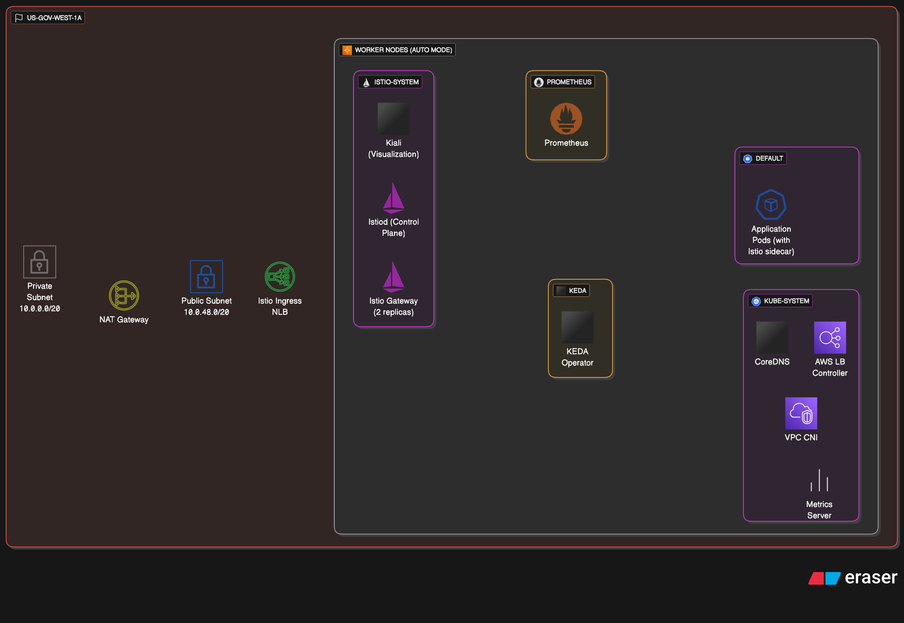

# Enhanced EKS Cluster - us-gov-west-1

Production-ready EKS cluster with Auto Mode, KEDA, Istio, and comprehensive security for AWS GovCloud.



## Features

- **EKS Auto Mode**: Automated node provisioning and management
- **AI-Driven Operations**: Optional Bedrock AI agents for autonomous cluster management
- **Region**: us-gov-west-1 (AWS GovCloud)
- **High Availability**: 3 AZs with public/private subnets
- **Security & Compliance**:
  - KMS encryption for EKS secrets and EBS volumes (FIPS 140-2)
  - GuardDuty for EKS runtime threat detection
  - AWS Security Hub with CIS benchmarks
  - VPC endpoints for private connectivity (30+ services)
  - Istio service mesh with automatic mTLS
  - AWS Secrets Manager with KMS encryption
  - External Secrets Operator OR Secrets Store CSI Driver
- **Add-ons Installed**:
  - kube-proxy, vpc-cni, coredns
  - aws-ebs-csi-driver, aws-efs-csi-driver, aws-mountpoint-s3-csi-driver
  - ADOT (AWS Distro for OpenTelemetry) with X-Ray integration
- **Observability**:
  - Prometheus metrics collection
  - Kiali service mesh visualization
  - AWS X-Ray distributed tracing
  - CloudWatch Logs integration
- **Autoscaling**:
  - KEDA for event-driven autoscaling
  - Metrics Server for HPA
- **Networking**:
  - AWS Load Balancer Controller for ALB/NLB provisioning
  - Optional VPC endpoints for NAT-less operation

## Cost Estimate

**us-gov-west-1 GovCloud Pricing:**

| Duration | Estimated Cost | Notes |
|----------|----------------|-------|
| **2 Days** | $55-65 | Testing/POC |
| **1 Month** | $850-1,300 | Light production workload |
| **1 Month** | $1,300-1,900 | Moderate production workload |

**Key Cost Components:**
- EKS Control Plane: $87.60/month (fixed)
- NAT Gateway: $98.55/month (1 gateway for cost savings)
- Auto Mode Compute: $500-800/month (scales with workload)
- Storage, observability, load balancers: ~$100/month
- Security (GuardDuty, Security Hub, KMS): ~$40-50/month
- VPC Endpoints (if enabled): ~$50-100/month
- AI Operations (if enabled): ~$50-100/month

**Cost Optimization:**
- Single NAT Gateway saves ~$200/month vs 3 NAT Gateways
- VPC endpoints eliminate NAT gateway costs entirely (optional)
- Auto Mode optimizes instance selection automatically
- Use Savings Plans for 30-40% compute savings

For detailed pricing, use the [AWS Pricing Calculator](https://calculator.aws).

## Prerequisites

- AWS CLI configured for us-gov-west-1
- Terraform >= 1.0
- kubectl

## Deployment

```bash
terraform init
terraform plan
terraform apply
```

## Configure kubectl

```bash
aws eks update-kubeconfig --region us-gov-west-1 --name enhanced-eks-cluster
```

## Verify Installation

```bash
# Check cluster
kubectl get nodes

# Check add-ons
kubectl get pods -n kube-system

# Check KEDA
kubectl get pods -n keda

# Check Istio
kubectl get pods -n istio-system

# Check AWS Load Balancer Controller
kubectl get pods -n kube-system -l app.kubernetes.io/name=aws-load-balancer-controller

# Check Kiali
kubectl get pods -n istio-system -l app=kiali

# Check Prometheus
kubectl get pods -n prometheus

# Verify KMS encryption
aws kms describe-key --key-id alias/enhanced-eks-cluster-eks-secrets --region us-gov-west-1

# Check GuardDuty status
aws guardduty list-detectors --region us-gov-west-1

# View Security Hub findings
aws securityhub get-findings --region us-gov-west-1 --max-items 10

# List VPC endpoints (if enabled)
aws ec2 describe-vpc-endpoints --region us-gov-west-1 --filters "Name=vpc-id,Values=$(terraform output -raw vpc_id)"
```

## Security Features

### KMS Encryption (FIPS 140-2)

All Kubernetes secrets and EBS volumes are encrypted at rest with customer-managed KMS keys:

- **EKS Secrets**: Automatic encryption for all Kubernetes secrets
- **EBS Volumes**: Region-wide default encryption for all volumes
- **Key Rotation**: Enabled automatically (annual)
- **Deletion Protection**: 30-day recovery window

### GuardDuty Runtime Security

Continuous threat detection for your EKS cluster:

- **EKS Audit Logs**: Monitors Kubernetes API activity
- **Malware Detection**: Scans EBS volumes for threats
- **Threat Detection**: Privilege escalation, crypto mining, container escapes
- **Alerting**: SNS topic + CloudWatch Logs (90-day retention)

Subscribe to GuardDuty alerts:
```bash
aws sns subscribe \
  --topic-arn $(terraform output -raw guardduty_sns_topic_arn) \
  --protocol email \
  --notification-endpoint your-email@example.com \
  --region us-gov-west-1
```

### AWS Security Hub (CIS Benchmarks)

Automated compliance monitoring and security posture management:

- **CIS AWS Foundations Benchmark v1.4.0**: 100+ automated checks
- **AWS Foundational Security Best Practices**: Additional security controls
- **GuardDuty Integration**: Centralized security findings
- **Compliance Dashboard**: Real-time compliance status

View compliance status:
```bash
# Console: Security Hub → Standards → CIS AWS Foundations Benchmark
# CLI:
aws securityhub get-findings \
  --region us-gov-west-1 \
  --filters '{"ComplianceStatus":[{"Value":"FAILED","Comparison":"EQUALS"}]}'
```

Subscribe to Security Hub alerts:
```bash
aws sns subscribe \
  --topic-arn $(terraform output -raw security_hub_sns_topic_arn) \
  --protocol email \
  --notification-endpoint your-email@example.com \
  --region us-gov-west-1
```

### VPC Endpoints (Private Connectivity)

Enable VPC endpoints to operate without NAT gateway:

```hcl
# In terraform.tfvars
enable_vpc_endpoints = true
```

**30+ Interface Endpoints:**
- Compute: EC2, ECS, Lambda
- Containers: ECR (API + DKR)
- Storage: EFS
- Databases: RDS, DynamoDB
- AI/ML: Bedrock (Runtime, Agent, Agent Runtime), SageMaker
- Streaming: Kinesis, Kinesis Firehose
- Messaging: SQS, SNS, EventBridge
- Observability: CloudWatch, X-Ray
- Security: Secrets Manager, KMS, STS, SSM

**Gateway Endpoints (Free):**
- S3, DynamoDB

**Benefits:**
- No NAT gateway required (saves ~$100/month)
- Lower latency to AWS services
- Enhanced security (traffic stays in AWS network)
- Required for air-gapped environments

## Access Kiali Dashboard

```bash
# Port-forward to access Kiali UI
kubectl port-forward -n istio-system svc/kiali-server 20001:20001

# Open browser to http://localhost:20001
```

## Auto Mode

EKS Auto Mode automatically manages:
- Node provisioning and scaling
- Compute capacity optimization
- System pod placement
- Storage provisioning

## Istio Service Mesh

Istio is installed with automatic mTLS enabled for secure service-to-service communication. Includes:
- Istio base (CRDs)
- Istiod (control plane)
- Istio Ingress Gateway (LoadBalancer)

## KEDA Autoscaling

KEDA enables event-driven autoscaling based on various metrics and event sources.

## Kiali Service Mesh Visualization

Kiali provides real-time visualization of your Istio service mesh:
- Service topology graph
- Traffic flow and metrics
- Health status of services
- Configuration validation
- Distributed tracing integration

Access via port-forward: `kubectl port-forward -n istio-system svc/kiali-server 20001:20001`

## AWS Load Balancer Controller

Automatically provisions ALBs and NLBs for Kubernetes Ingress and Service resources:

```yaml
# ALB Ingress example
apiVersion: networking.k8s.io/v1
kind: Ingress
metadata:
  annotations:
    alb.ingress.kubernetes.io/scheme: internet-facing
spec:
  ingressClassName: alb
  rules:
  - host: app.example.com
    http:
      paths:
      - path: /
        pathType: Prefix
        backend:
          service:
            name: my-service
            port:
              number: 80
```

## Distributed Tracing with ADOT and AWS X-Ray

ADOT (AWS Distro for OpenTelemetry) is installed and configured to send traces to AWS X-Ray.

### Setup Tracing in Your Application

**1. Deploy ADOT Collector ConfigMap:**

```yaml
apiVersion: v1
kind: ConfigMap
metadata:
  name: adot-collector-config
  namespace: default
data:
  config.yaml: |
    receivers:
      otlp:
        protocols:
          grpc:
            endpoint: 0.0.0.0:4317
          http:
            endpoint: 0.0.0.0:4318
    processors:
      batch:
        timeout: 10s
    exporters:
      awsxray:
        region: us-gov-west-1
    service:
      pipelines:
        traces:
          receivers: [otlp]
          processors: [batch]
          exporters: [awsxray]
```

**2. Add ADOT Collector Sidecar to Your Pods:**

```yaml
apiVersion: v1
kind: Pod
metadata:
  name: my-app
spec:
  containers:
  - name: app
    image: my-app:latest
    env:
    - name: OTEL_EXPORTER_OTLP_ENDPOINT
      value: "http://localhost:4317"
  
  - name: adot-collector
    image: public.ecr.aws/aws-observability/aws-otel-collector:latest
    env:
    - name: AWS_REGION
      value: us-gov-west-1
    command:
    - "/awscollector"
    - "--config=/conf/config.yaml"
    volumeMounts:
    - name: adot-config
      mountPath: /conf
  
  volumes:
  - name: adot-config
    configMap:
      name: adot-collector-config
```

**3. Instrument Your Application:**

Python example:
```python
from opentelemetry import trace
from opentelemetry.sdk.trace import TracerProvider
from opentelemetry.sdk.trace.export import BatchSpanProcessor
from opentelemetry.exporter.otlp.proto.grpc.trace_exporter import OTLPSpanExporter

trace.set_tracer_provider(TracerProvider())
otlp_exporter = OTLPSpanExporter(endpoint="http://localhost:4317", insecure=True)
trace.get_tracer_provider().add_span_processor(BatchSpanProcessor(otlp_exporter))

tracer = trace.get_tracer(__name__)

with tracer.start_as_current_span("my-operation"):
    # Your code here
    pass
```

**4. View Traces in AWS X-Ray Console:**

- Navigate to AWS X-Ray in us-gov-west-1
- View Service Map for topology
- View Traces for request details
- Analyze latency and errors

## Secrets Management

Two options for secrets management:

### Option 1: External Secrets Operator (Default)
- ⚠️ NOT FedRAMP authorized
- Better developer experience
- Automatic sync from Secrets Manager to Kubernetes
- Declarative ExternalSecret resources

### Option 2: Secrets Store CSI Driver (FedRAMP Compliant)
- ✅ AWS-supported, FedRAMP compliant
- Secrets mounted as files in pods
- Direct integration with Pod Identity
- Required for strict FedRAMP compliance

See [SECRETS-MANAGEMENT.md](SECRETS-MANAGEMENT.md) and [FEDRAMP-COMPLIANCE.md](FEDRAMP-COMPLIANCE.md) for detailed comparison.

## Configuration

All configuration is centralized in `terraform.tfvars`. Key toggles:

```hcl
# Enable/disable VPC endpoints for private connectivity
enable_vpc_endpoints = false

# Enable/disable GuardDuty runtime security
enable_guardduty = true

# Enable/disable Security Hub CIS benchmarks
enable_security_hub = true

# Secrets management (choose one)
enable_external_secrets = true   # NOT FedRAMP authorized
enable_secrets_store_csi = false # FedRAMP compliant alternative

# AI-driven operations
enable_bedrock_agent = false # Bedrock AI agent for autonomous operations

# Namespaces with Pod Identity permissions
pod_identity_namespaces = ["default"]
```

## STIG/FedRAMP Compliance

This cluster is designed for GovCloud STIG/FedRAMP compliance:

- ✅ KMS encryption (FIPS 140-2 validated)
- ✅ GuardDuty runtime monitoring
- ✅ Security Hub CIS benchmarks
- ✅ VPC endpoints for private connectivity
- ✅ Istio mTLS for service-to-service encryption
- ✅ CloudWatch Logs with KMS encryption
- ✅ EBS encryption by default
- ✅ Pod Identity for least-privilege IAM

See [CONSIDERATIONS.md](CONSIDERATIONS.md) for additional hardening steps.

## AI-Driven Operations (Optional)

Enable autonomous EKS operations with Amazon Bedrock AI agents:

```hcl
# In terraform.tfvars
enable_bedrock_agent = true
```

**Features:**
- Autonomous incident response
- Predictive scaling
- Security posture optimization
- Automated rollback
- Self-healing workflows

**Cost:** ~$50-100/month

See [AI-GETTING-STARTED.md](AI-GETTING-STARTED.md) for setup guide.

## Documentation

- [ARCHITECTURE.md](ARCHITECTURE.md) - Detailed architecture specifications
- [CONSIDERATIONS.md](CONSIDERATIONS.md) - Production readiness checklist
- [SECRETS-MANAGEMENT.md](SECRETS-MANAGEMENT.md) - Secrets management guide
- [FEDRAMP-COMPLIANCE.md](FEDRAMP-COMPLIANCE.md) - FedRAMP compliance guide
- [SBOM.md](SBOM.md) - Software Bill of Materials
- [DAY2-OPERATIONS.md](DAY2-OPERATIONS.md) - Day 2 operations guide
- [AI-GETTING-STARTED.md](AI-GETTING-STARTED.md) - AI agent setup guide
- [SRE-RUNBOOKS.md](SRE-RUNBOOKS.md) - Automated runbooks
- [AI-PLAYBOOKS.md](AI-PLAYBOOKS.md) - Agentic workflows

## Support

For issues or questions, refer to:
- [AWS EKS Best Practices](https://aws.github.io/aws-eks-best-practices/)
- [Istio Documentation](https://istio.io/latest/docs/)
- [KEDA Documentation](https://keda.sh/docs/)
